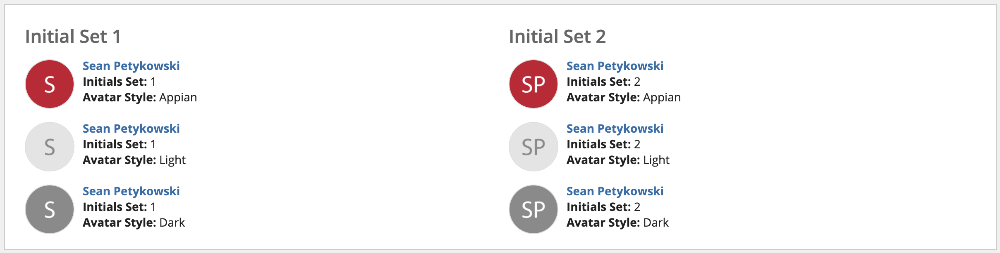

# Appian User Initials Avatar
Appian utility application to display user avatars based on a user's first and last name.




## Requirements

The User Initials Avatar application depends on the following Appian Cloud approved plug-in(s):

* Content Tools (v1.0.1)
  * finddocumentsbyname()

## Installation

Installing the Appian User Initials Avatar application follows the same process as installing any new Appian application into your environment. The application is ready for use upon installation, but if you would like to configure the default `initials set` and `style` properties then refer to the [Configuration](#Configuration) section.

## Usage

**Display Default Initials Avatar when User Profile Picture Not Found**

```
rule!UIA_userImageWithReplacementAvatar(
  user: loggedInUser()
)
```

**Display Double Initials Avatar with Light Style when User Profile Picture Not Found**

```
rule!UIA_userImageWithReplacementAvatar(
  user: loggedInUser(),
  initialSet: cons!UIA_INITIALS_SET_DOUBLE,
  style: cons!UIA_STYLE_AVATAR_DOUBLE_LIGHT
)
```

**Display Single Initial Avatar**

```
rule!UIA_documentAvatarSingleInitialForUserWithStyle(
  user: loggedInUser()
)
```

**Display Double Initials Avatar with Dark Style**

```
rule!UIA_documentAvatarDoubleInitialsForUserWithStyle(
  user: loggedInUser(),
  style: cons!UIA_STYLE_AVATAR_DOUBLE_DARK
)
```

## Configuration

### Set Security
**UIA All Users**

* Members of this group are allowed to view all user initials avatars.

**UIA Administrators**

* Members of this group will be given Administrator permissions to modify the User Initials Avatar application.

------

### Set Default Constant Values

**UIA_INITIALS_SET_DEFAULT**

* **Type:** `Number (Integer)`

* **Description:** Represents the default initials set to display in the user's avatar.

* **Acceptable Values:**
  * `1`
  * `2`

**UIA_STYLE_AVATAR_SINGLE_DEFAULT**

- **Type:** `Folder`

- **Description:** Represents the default style for single initial avatars.

- **Acceptable Values:**
  - `Single Initial/appian`
  - `Single Initial/dark`
  - `Single Initial/light`

**UIA_STYLE_AVATAR_DOUBLE_DEFAULT**

- **Type:** `Folder`

- **Description**: Represents the default style for double initial avatars.

- **Acceptable Values:**
  - `Double Initials/appian`
  - `Double Initials/dark`
  - `Double Initials/light`

